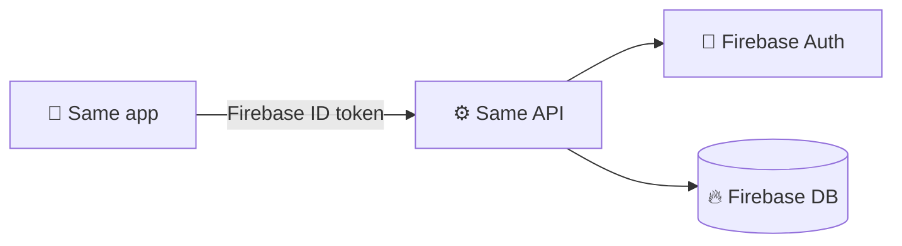
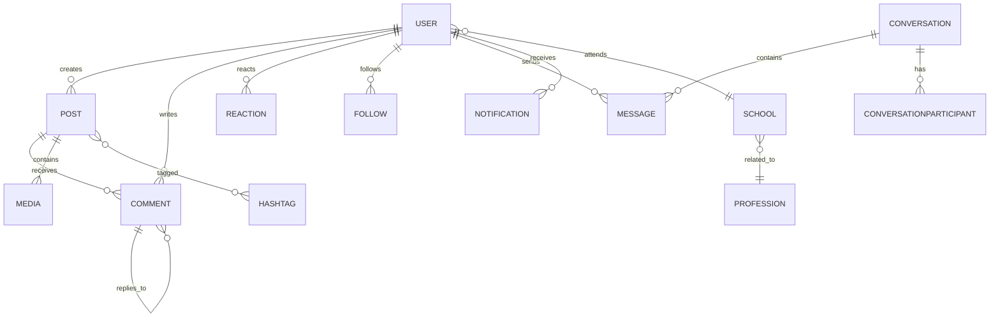

<div align="center">

```
 ____    _    __  __ _____
/ ___|  / \  |  \/  | ____|
\___ \ / _ \ | |\/| |  _|
 ___) / ___ \| |  | | |___
|____/_/   \_\_|  |_|_____|
```

### 🎓 The social network for Geneva students


</div>

---

## 📌 Summary

**Same** is a Threads-like social network for students in Geneva. This repo is its **REST API** (ASP.NET Core): it handles users, posts, comments, reactions, follows, hashtags, DMs and notifications.

The API sits **in front of Firebase** (auth + data). Clients only talk to the API, which keeps all business rules in one place.



---

## ✨ Features

- 🧑 **Profiles**: bio, pictures, school, profession, private / verified accounts
- 📝 **Posts** with media, visibility, hashtags and saved posts
- 🗨️ **Comments** with nested replies
- ❤️ **Reactions** on posts and comments
- 👥 **Follow** and **block** system
- ✉️ **DMs**: 1-to-1 and group conversations
- 🔔 **Notifications**
- 📖 **Swagger UI** for live API docs

---

## 🗺️ Data model

Main relations (full detail in [MLD.md](./MLD.md)):



---

## 📡 Endpoints

> 🔒 All endpoints require a valid Firebase token.

<details>
<summary><b>🧑 Users</b></summary>

| Method | Endpoint | Description |
|---|---|---|
| `GET` | `/api/users/{id}` | Get a profile |
| `PUT` | `/api/users/{id}` | Update a profile |
| `POST` | `/api/users/{id}/follow` | Follow a user |
| `DELETE` | `/api/users/{id}/follow` | Unfollow |
| `POST` | `/api/users/{id}/block` | Block a user |
| `DELETE` | `/api/users/{id}/block` | Unblock |

</details>

<details>
<summary><b>📝 Posts & comments</b></summary>

| Method | Endpoint | Description |
|---|---|---|
| `GET` | `/api/posts` | Get the feed |
| `POST` | `/api/posts` | Create a post |
| `GET` | `/api/posts/{id}` | Get one post |
| `PUT` | `/api/posts/{id}` | Edit a post |
| `DELETE` | `/api/posts/{id}` | Delete a post |
| `GET` | `/api/posts/{id}/comments` | List comments |
| `POST` | `/api/posts/{id}/comments` | Add a comment |
| `DELETE` | `/api/comments/{id}` | Delete a comment |
| `POST` | `/api/posts/{id}/reactions` | React to a post |
| `POST` | `/api/posts/{id}/save` | Save a post |

</details>

<details>
<summary><b>✉️ Messages</b></summary>

| Method | Endpoint | Description |
|---|---|---|
| `GET` | `/api/conversations` | My conversations |
| `POST` | `/api/conversations` | Start a conversation |
| `GET` | `/api/conversations/{id}/messages` | Read messages |
| `POST` | `/api/conversations/{id}/messages` | Send a message |

</details>

<details>
<summary><b>🔔 Notifications</b></summary>

| Method | Endpoint | Description |
|---|---|---|
| `GET` | `/api/notifications` | My notifications |
| `PUT` | `/api/notifications/{id}/read` | Mark as read |

</details>

---

## 📁 Project structure

```
SameApi
├── SameApi.App        → entry point (Program.cs)
├── SameApi.Business   → logic + AutoMapper profile
├── SameApi.Data       → base context, repositories
├── SameApi.Db         → DbContext + Unit of Work
├── SameApi.Dto        → DTOs
└── SameApi.Model      → domain models
```

---

## ⚡ Quick start

**Prerequisites:** [.NET 10](https://dotnet.microsoft.com/) · a Firebase project

```bash
git clone https://github.com/Tisa40486/Same.git
cd Same
# add your Firebase credentials (appsettings.json or env vars)
dotnet run --project SameApi.App
```

Then open Swagger UI to test the endpoints.

---

<div align="center">

📧 [same@sames.school](mailto:same@sames.school) · 🧑‍💻 [@Tisa40486](https://github.com/Tisa40486)

</div>