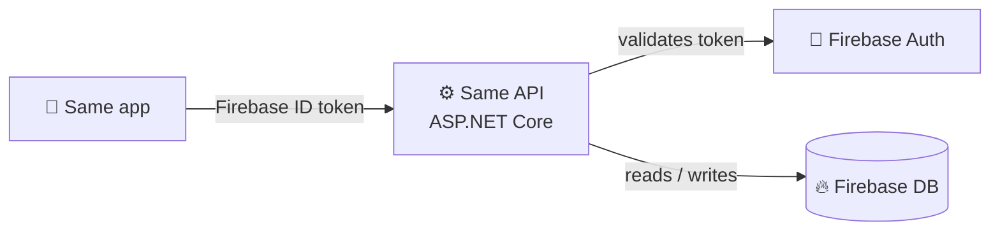
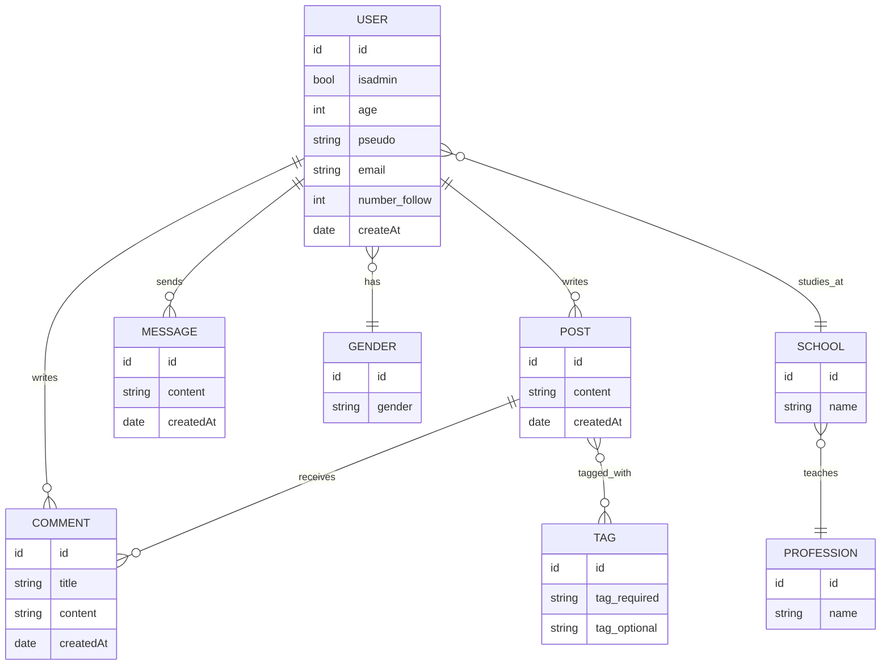

<div align="center">

```
 ____    _    __  __ _____
/ ___|  / \  |  \/  | ____|
\___ \ / _ \ | |\/| |  _|
 ___) / ___ \| |  | | |___
|____/_/   \_\_|  |_|_____|
```

### 🎓 The social network built by Geneva students, for Geneva students.


**Posts · Comments · DMs · Tags** — the engine behind the Same app.

</div>

---

## 💡 What is Same?

Same is a Threads-like app for **every student in Geneva**: one place to post, reply, follow people from your school, and slide into DMs.

This repo is the **API** that powers it. It stores and serves everything, and keeps the business logic in one place.

---

## 🧭 Architecture



> The API sits **in front of Firebase**: clients never touch the data directly. All rules (permissions, validation, logic) stay under our control.

---

## ✨ Features

| | |
|---|---|
| 🔐 **Auth** | Firebase sign-in, token validated by the API |
| 🧑 **Profiles** | Pseudo, age, gender, school, profession, followers |
| 📝 **Posts** | Create, read, edit, delete |
| 🗨️ **Comments** | Reply under any post |
| ✉️ **DMs** | Private messages between students |
| 🏷️ **Tags** | Required + optional tags to organize content |
| 📖 **Swagger** | Interactive docs, try every endpoint live |

---

## 🗺️ Data model



Full MLD → [MLD.md](./MLD.md)

---

## 📡 Endpoints

<details>
<summary><b>🧑 Users</b></summary>

| Method | Endpoint | Description |
|---|---|---|
| `GET` | `/api/users/{id}` | Get a profile |
| `PUT` | `/api/users/{id}` | Update a profile |

</details>

<details>
<summary><b>📝 Posts</b></summary>

| Method | Endpoint | Description |
|---|---|---|
| `GET` | `/api/posts` | Get the feed |
| `POST` | `/api/posts` | Create a post |
| `GET` | `/api/posts/{id}` | Get one post |
| `PUT` | `/api/posts/{id}` | Edit a post |
| `DELETE` | `/api/posts/{id}` | Delete a post |

</details>

<details>
<summary><b>🗨️ Comments</b></summary>

| Method | Endpoint | Description |
|---|---|---|
| `GET` | `/api/posts/{id}/comments` | Comments of a post |
| `POST` | `/api/posts/{id}/comments` | Add a comment |
| `DELETE` | `/api/comments/{id}` | Delete a comment |

</details>

<details>
<summary><b>✉️ Messages</b></summary>

| Method | Endpoint | Description |
|---|---|---|
| `GET` | `/api/messages` | My DMs |
| `POST` | `/api/messages` | Send a DM |

</details>

> 🔒 Every endpoint requires a valid Firebase token.

---

## 📁 Project structure

```
SameApi
├── 🚀 SameApi.App        → entry point (Program.cs)
├── 🧠 SameApi.Business   → logic + AutoMapper profile
├── 🧱 SameApi.Data       → base context, repositories, DAO interfaces
├── 💾 SameApi.Db         → DbContext + Unit of Work
├── 📦 SameApi.Dto        → data transfer objects
└── 🧩 SameApi.Model      → domain models
```

---

## ⚡ Quick start

```bash
# 1. Clone
git clone https://github.com/Tisa40486/Same.git
cd Same

# 2. Add your Firebase credentials (appsettings.json or env vars)

# 3. Run
dotnet run --project SameApi.App
```

Then open **Swagger UI** and start poking around 🎯

**Prerequisites:** [.NET 9](https://dotnet.microsoft.com/) · a Firebase project · VS or VS Code

---

<div align="center">

### 📬 Get in touch

📧 [same@sames.school](mailto:same@sames.school) · 🧑‍💻 [@Tisa40486](https://github.com/Tisa40486)

*Made with ☕ in Geneva*

</div>